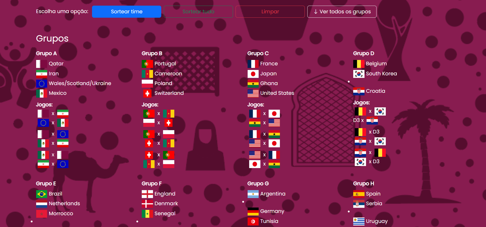
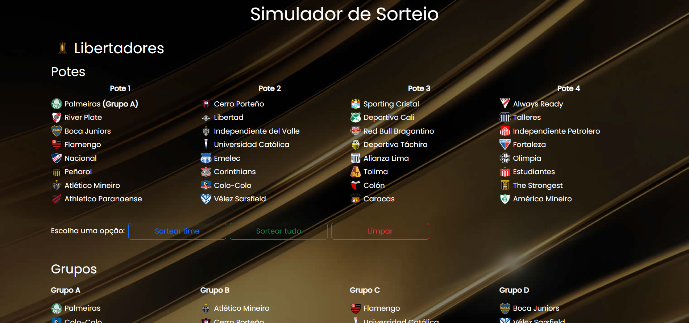

# ⚽ Football Tournament Simulator


**Interactive tournament draw and simulation system**

[](https://developer.mozilla.org/en-US/docs/Web/HTML)
[](https://developer.mozilla.org/en-US/docs/Web/CSS)
[](https://developer.mozilla.org/en-US/docs/Web/JavaScript)
[](https://getbootstrap.com/)

[🏆 View Projects](https://github.com/adrian1715/football-tournament-simulator) • [📝 Report Bug](https://github.com/adrian1715/football-tournament-simulator/issues) • [✨ Request Feature](https://github.com/adrian1715/football-tournament-simulator/issues)

Live Demo: [World Cup](https://portfolio-website-adrian-lobato.onrender.com/projects/simulators/copa-do-mundo-2022) • [Libertadores/Sul-Americana](https://portfolio-website-adrian-lobato.onrender.com/projects/simulators/libertadores-sulamericana-2022)

---

## 📖 About The Project

This repository contains **interactive football tournament simulators** that allow users to simulate draws and matches for major South American football tournaments. Built with vanilla JavaScript, these simulators provide an engaging way to experience tournament formats and visualize possible match outcomes.

### 🏆 Included Simulators

#### 1. ⚽ FIFA World Cup 2022 (Qatar)

A complete World Cup draw and simulation system featuring:

- 32 national teams organized in pots
- Group stage draw simulation
- Group stage match simulation
- Knockout stage bracket generation
- Team information and flags
- Full tournament progression

#### 2. 🏆 Copa Libertadores & Copa Sudamericana 2022

Simultaneous simulation of South America's premier club competitions:

- Copa Libertadores tournament system
- Copa Sudamericana tournament system
- Club team data with logos
- Group stage mechanics
- Knockout phase progression

---

## 🌟 Key Features

### General Features

- ✅ **Interactive Draw System** - Realistic tournament draw mechanics
- 🎲 **Random Match Simulation** - Automated score generation
- 🏆 **Complete Tournament Flow** - From groups to finals
- 🖼️ **Team Logos & Flags** - Visual representation of all teams
- 📊 **Real-time Updates** - Dynamic UI updates during simulation
- 🎯 **Authentic Rules** - Follows official tournament regulations
- 📱 **Responsive Design** - Works on all devices
- ⚡ **Fast Performance** - Smooth simulations without lag

### World Cup Simulator

- 🌍 **32 National Teams** - All Qatar 2022 participants
- 🎲 **Pot-based Draw** - Follows FIFA seeding rules
- 🏟️ **Group Stage** - 8 groups of 4 teams
- 🏆 **Knockout Rounds** - Round of 16 → Quarter-finals → Semi-finals → Final
- 📈 **Group Tables** - Points, goals, goal difference tracking
- 🥇 **Winner Determination** - Simulates entire tournament to crown champion

### Libertadores/Sudamericana Simulator

- ⚽ **Multiple Tournaments** - Two competitions in one interface
- 🏆 **Group Phase** - Authentic group stage format
- 🎯 **Knockout Stages** - Quarterfinals through finals
- 🔄 **Tournament Switching** - Toggle between competitions
- 📊 **Match Results** - Detailed score tracking

---

## 🛠️ Built With

- **HTML5** - Semantic structure and layout
- **CSS3** - Custom styling and animations
- **JavaScript (Vanilla)** - Tournament logic and simulations
- **Bootstrap 4** - Responsive grid system and components

---

## 💻 Getting Started

### Prerequisites

- A modern web browser (Chrome, Firefox, Safari, Edge)
- No additional installations required!

### Installation

1. **Clone the repository**

   ```bash
   git clone https://github.com/adrian1715/football-tournament-simulator.git
   cd football-tournament-simulator
   ```

2. **Open the simulators**

   **World Cup Simulator:**

   ```bash
   cd "Copa do Mundo 2022"
   open index.html  # macOS
   # or
   start index.html  # Windows
   ```

   **Libertadores/Sudamericana Simulator:**

   ```bash
   cd "Libertadores e Sul-Americana 2022"
   open index.html  # macOS
   # or
   start index.html  # Windows
   ```

3. **Or use a local server** (optional)

   ```bash
   # Using Python 3
   python -m http.server 8000

   # Using Node.js http-server
   npx http-server
   ```

   Then navigate to `http://localhost:8000`

---

## 📁 Project Structure

```
football-tournament-simulator/
├── Copa do Mundo 2022/
│   ├── index.html              # World Cup main page
│   ├── style.css              # World Cup styles
│   └── app.js                 # World Cup simulation logic
│
├── Libertadores e Sul-Americana 2022/
│   ├── index.html              # Libertadores/Sudamericana main page
│   ├── style.css              # Competition styles
│   └── app.js                 # Tournament simulation logic
│
├── images/
│   ├── Copa do Mundo/         # National team flags (32 images)
│   ├── Libertadores/          # Club logos for Libertadores
│   ├── Sul-Americana/         # Club logos for Sudamericana
│   ├── bg-1.jpg              # Background image
│   ├── libertadores logo.png
│   ├── libertadores-bg.png
│   ├── sul-americana logo.png
│   └── sulamericana banner.jpg
│
├── README.md                  # Documentation (English)
└── README-ptbr.md             # Documentation (Portuguese)
```

---

## 🎮 How to Use

### World Cup Simulator

1. **View Initial Pots**

   - See all 32 teams organized in 4 pots (Pot 1-4)
   - Teams grouped by FIFA rankings and geographic zones

2. **Simulate Group Draw**

   - Click "Sortear Grupos" (Draw Groups)
   - Watch as teams are randomly drawn into 8 groups (A-H)
   - Each group contains 4 teams from different pots

3. **Simulate Group Stage**

   - Click "Simular Fase de Grupos" (Simulate Group Stage)
   - All group matches are simulated automatically
   - View group tables with standings, points, and goal differences

4. **View Knockout Bracket**

   - Top 2 teams from each group advance
   - Knockout bracket is generated automatically
   - Shows matchups for Round of 16

5. **Simulate Knockout Rounds**
   - Click to simulate each knockout round
   - Progress through: R16 → QF → SF → Final
   - Winner crowned as World Cup Champion!

### Libertadores/Sudamericana Simulator

1. **Choose Tournament**

   - Interface displays both tournaments
   - Toggle between Libertadores and Sudamericana

2. **View Teams**

   - See participating clubs from each country
   - Club logos displayed with names

3. **Simulate Draws**

   - Click to draw group stage
   - Teams distributed across groups

4. **Run Tournament**
   - Simulate group matches
   - Generate knockout brackets
   - Progress to finals

---

## 🎯 Features in Detail

### Group Stage Mechanics

- **Points System:**

  - Win: 3 points
  - Draw: 1 point
  - Loss: 0 points

- **Tiebreakers:**
  - Goal difference
  - Goals scored
  - Head-to-head results

---

## 🎨 User Interface

### World Cup Simulator

**Sections:**

- 📋 **Pots Display** - Initial seeding
- 🏟️ **Groups Area** - 8 groups with 4 teams each
- 📊 **Group Tables** - Standings and statistics
- 🏆 **Knockout Bracket** - Tournament tree visualization
- 🥇 **Winner Display** - Champion announcement

**Visual Elements:**

- National team flags
- FIFA World Cup 2022 branding
- Color-coded groups
- Responsive layout



### Libertadores/Sudamericana Simulator

**Sections:**

- 🏆 **Tournament Selection** - Choose competition
- ⚽ **Team Display** - All participating clubs
- 📋 **Group Phase** - Club group assignments
- 🎯 **Knockout Phase** - Elimination brackets
- 🥇 **Finals** - Championship match

**Visual Elements:**

- Club badges and logos
- Competition branding
- Split-screen interface for both tournaments
- Animated transitions



---

## 📱 Responsive Design

Both simulators are fully responsive:

### Breakpoints

- 📱 **Mobile:** 320px - 767px
- 📱 **Tablet:** 768px - 1024px
- 💻 **Desktop:** 1025px+

### Mobile Optimizations

- Stacked layouts for easy scrolling
- Touch-friendly buttons
- Optimized flag/logo sizes
- Compressed group tables

---

## 🎓 What I Learned

Building these simulators improved my skills in:

### JavaScript Skills

- ✅ **Algorithm Design:** Complex draw and simulation logic
- ✅ **Data Structures:** Managing teams, groups, matches
- ✅ **DOM Manipulation:** Dynamic content generation
- ✅ **Event Handling:** Interactive user controls
- ✅ **Randomization:** Fair and realistic random draws
- ✅ **State Management:** Tracking tournament progression

### Problem Solving

- ✅ **Tournament Logic:** Implementing official rules
- ✅ **Bracket Generation:** Creating elimination trees
- ✅ **Score Calculation:** Points, goal difference, tiebreakers
- ✅ **Data Organization:** Efficient team and match storage

### Design & UX

- ✅ **Sports UI Design:** Creating engaging sports interfaces
- ✅ **Visual Hierarchy:** Organizing complex information
- ✅ **Responsive Layouts:** Adapting for all screen sizes
- ✅ **User Flow:** Guiding users through simulation steps

---

## 🏆 Tournament Details

### FIFA World Cup 2022 (Included Teams)

**Group Stage Format:**

- 8 groups (A through H)
- 4 teams per group
- Round-robin format
- Top 2 advance to knockout

**Knockout Format:**

- Round of 16 (8 matches)
- Quarter-finals (4 matches)
- Semi-finals (2 matches)
- Third place playoff
- Final

### Copa Libertadores

**Participating Countries:**

- 🇦🇷 Argentina
- 🇧🇷 Brazil
- 🇨🇱 Chile
- 🇨🇴 Colombia
- 🇪🇨 Ecuador
- 🇵🇾 Paraguay
- 🇵🇪 Peru
- 🇺🇾 Uruguay
- 🇻🇪 Venezuela
- 🇧🇴 Bolivia

### Copa Sudamericana

**Format:**

- Group stage
- Knockout rounds
- Two-leg matches
- Away goals rule (if applicable)

---

## 🤝 Contributing

Contributions are welcome! To contribute:

1. Fork the project
2. Create your feature branch (`git checkout -b feature/AmazingFeature`)
3. Commit your changes (`git commit -m 'Add some AmazingFeature'`)
4. Push to the branch (`git push origin feature/AmazingFeature`)
5. Open a Pull Request

### Contribution Ideas

- Add more tournaments (Euro, Champions League, etc.)
- Improve simulation algorithms
- Add historical tournament data
- Create mobile app version
- Implement multiplayer predictions
- Add betting odds simulation

---

## 📝 License

This project is open source and available under the [MIT License](LICENSE).

---

## ⚠️ Disclaimer

This is a **fan-made educational project**. It is not affiliated with, endorsed by, or connected to FIFA, CONMEBOL, or any official football organizations. All team names, logos, and trademarks are property of their respective owners.

This simulator is intended for:

- ✅ Entertainment and education
- ✅ Learning JavaScript and web development
- ✅ Understanding tournament formats
- ✅ Portfolio demonstration

---

## 👨‍💻 Author

**Adrian Lobato**

- GitHub: [@adrian1715](https://github.com/adrian1715)
- LinkedIn: [Adrian Lobato](https://linkedin.com/in/adrian-lobato)
- Portfolio: [portfolio-website-adrian-lobato.onrender.com](https://portfolio-website-adrian-lobato.onrender.com/)

---

## 🙏 Acknowledgments

- **FIFA** and **CONMEBOL** for inspiring the tournament formats
- Team flag and logo image sources
- The football community for tournament data
- Bootstrap for responsive framework

---

## 📊 Project Stats


---

**If you enjoy these simulators, please consider giving the repo a ⭐**

_I truly appreciate all your support!_

[⬆ Back to Top](#-football-tournament-simulator)
